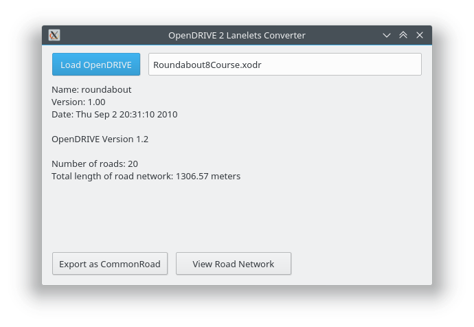

# OpenDRIVE 2 Lanelet - Converter

## A few addition to the original implementation
We add the ability to find lanelets that split from, merge into and cross a given lanlet in this version (similar to the idea in [Lanelet2](https://www.mrt.kit.edu/z/publ/download/2018/Poggenhans2018Lanelet2.pdf)). This is useful to reason about where the vehicle may coming and interact with my current path. 

## Original ReadME
We provide the code for an OpenDRIVE ([www.opendrive.org](http://www.opendrive.org)) to lanelets ([www.mrt.kit.edu/software/liblanelet](https://www.mrt.kit.edu/software/libLanelet/libLanelet.html)) converter, which has been introduced in our [paper](https://mediatum.ub.tum.de/doc/1449005/1449005.pdf): M. Althoff, S. Urban, and M. Koschi, "Automatic Conversion of Road Networks from OpenDRIVE to Lanelets," in Proc. of the IEEE International Conference on Service Operations and Logistics, and Informatics, 2018.
Additionally, we provide a converter from CommonRoad lanelets to OSM lanelets and vice versa.

[](https://opendrive2lanelet.readthedocs.io/en/latest/?badge=latest)
[](https://badge.fury.io/py/opendrive2lanelet)
[](https://pypi.org/project/opendrive2lanelet/)
[](https://www.gnu.org/licenses/gpl-3.0.de.html)


## Installation

### Installing from source

```bash
git clone https://gitlab.lrz.de/cps/opendrive2lanelet.git
python setup.py install
```

Public source (only released versions): https://gitlab.lrz.de/tum-cps/opendrive2lanelet.git


### Using pip:

```bash
pip install opendrive2lanelet
```


## Example OpenDRIVE Files

Download example files from: http://opendrive.org/download.html

## Usage

### Using our provided GUI

Opening OpenDRIVE to CommonRoad converter GUI from the command line:
```bash
opendrive2lanelet-gui
```



### Converting files using the command line

Converting a file from OpenDRIVE to CommonRoad with the command line:  
```bash
opendrive2lanelet-convert input_file.xodr -o output_file.xml
```

Converting a file from OSM lanelets to CommonRoad lanelets with the command line (for description of input parameters see documentation):  
```bash
osm-convert inputfile.xml --reverse -o outputfile.osm --adjencies --proj "+proj=etmerc +lat_0=38 +lon_0=125 +ellps=bessel"
```
For the conversion of CommonRoad lanelets to OSM lanelets change the input and output file accordingly.
Visualizing the results of the conversion to CommonRoad:
```bash
opendrive2lanelet-visualize input-file.xml
```

## Documentation

The documentation is published on the [CommonRoad](https://commonroad.in.tum.de/static/docs/opendrive2lanelet/index.html) homepage.


To generate the documentation from source, first install the necessary dependencies with pip:
```bash
pip install -r docs_requirements.txt
```

Then you can run
```bash
cd docs && make html
```
for example.


## Known Problems

- When trying to use the gui.py under Wayland, the following error occurs:
  ```
  This application failed to start because it could not find or load the Qt platform plugin "wayland" in "".
  Available platform plugins are: eglfs, linuxfb, minimal, minimalegl, offscreen, vnc, xcb.
  Reinstalling the application may fix this problem.
  ```
  Set the platform to *xcb* using this command: ```export QT_QPA_PLATFORM="xcb"```

## Authors

Sebastian Maierhofer (current maintainer)  
Benjamin Orthen  
Stefan Urban
